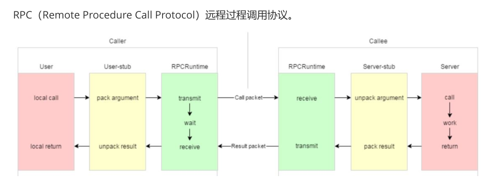

# 简介

这是一个基于 muduo+protobuf 实现的一个分布式rpc（远程过程调用）框架。

## 依赖库
    muduo
    protobuf
## 编译
    To build, run:
        sh autobuild.sh
## 代码目录
    ├──mprpc                    (根目录)
        ├── autobuild.sh        (自定义编译脚本)
        ├── bin                 (可执行文件)
        ├── build               (编译产生的中间文件)
        ├── docs                (文档目录)
        ├── example             (实例demo)
        ├── lib                 (生成的lib文件)
        ├── src                 (源文件)
        └── test                (相关技术的代码)

# 1 原理相关

## 1.1 单机、集群、分布式概念

- 单机：服务在一个机器上
    -  缺点：
        - 受限于硬件资源，并发量小
        - 机器宕机后，服务不可用
        - 模块全部都在一个机器上，耦合程度高，对单个模块修改后编译和部署耗费很高的时间

- 集群：服务在多个机器上
    - 优点：
        - 可以扩展硬件资源，增加并发量
        - 服务可用性变高
    - 缺点：
        - 单台机器的服务模块在一起，耦合程度高，对单个模块修改后编译和部署成本很高

- 分布式：模块间解耦，将模块部署在不同机器上，所有的模块构成一个服务
    - 优点
        - 可以扩展硬件资源，增加并发量
        - 服务可用性变高
        - 模块解耦后，对单独模块修改后可以降低编译和部署成本
        - 可以针对模块的功能选择不同的机器配置，比如说CPU密集型服务选择CPU性能好的机器，IO密集型服务选择内存高，网络带宽大的机器。

1. 大系统的软件模块如何划分? （需要经验）
    - 划分的模块不清晰造成的缺陷
        - 各模块可能实现大量重复的代码
2. 各模块之间怎么访问呢？
    - 不同模块部署在不同主机上。（方法调用封装到rpc框架中）
    - 不同模块部署在相同主机上，进程不同

## 1.2 rpc通信原理

分为三层：调用方和被调用方、序列化和反序列化、网络通信

rpc调用过程：
1. 调用方调用本地客户端stub程序，调用想要使用的功能方法名；
2. 客户端stub程序接收请求，将客户端请求调用的方法名、携带的参数信息做序列化操作，打包成数据包；
3. 客户端stub查找远程服务器程序的IP，通过网络传输发送给服务端；
4. 服务端方收到网络消息，进行反序列化操作；
5. 服务端stub程序准备相关数据，调用本地server对应的功能方法，并传入响应参数，进行业务处理；
6. 服务方将执行结果返回给他stub程序。
7. 服务端stub程序进行序列化，通过网络传输给客户端；
8. 客户端收到数据后，进行反序列化，并传给调用方。
9. 调用方得到调用结果，rpc调用过程结束。

### 1.3 对rpc框架的技术选型
rpc框架基于网络传输和数据格式转化。网络库选择muduo，数据序列化和反序列化技术选择protobuf。选型原因如下：
网络库选用muduo的原因
业界比较流行的网络库有ace、boost asio、muduo、libevent
1. ace和boost asio代码都比较臃肿，并且boost asio 使用bind做回调，使得运行时的内存和时间代价较高。因此没有使用者两者。
2. libevent和muduo都是事件驱动的高性能、轻量级网络库，两者都是使用的Reactor模型，(muduo主要的思想是one loop per thread，也就是每个线程维护一个epoll对象)，根据muduo的官方说明书，muduo的吞吐量要比libevent高（比libevent吞吐量高的原因是libevent每次读取4096个字节，muduo没有限制），因此选择muduo。

序列化和反序列化选用protobuf，是因为protobuf存储空间效率更高
1. protobuf使用二进制存储，xml和json使用文本存储。
2. protobuf直接存储数据不用存储额外的信息，json需要存储key的名字

服务发现中心使用zookeeper的原因
比较著名的服务发现中心库有etcd、doozer、zookeeper。
- doozer在项目开展之后停滞了一段时间，不知道项目的发展状态，也不知道是否稳定。因此没有使用doozer。
- etcd：client和etcd网络通信时的一些交互不是那么友好。主要体现在两点，第一点是在leader选举时，etcd会放弃操作，并且不会给client发送放弃响应。第二点是如果client和etcd网络中断，client不会明确的知道当前的操作状态。因此没有使用etcd。
- zookeeper因为是一直以来比较稳定，没有什么明显的缺点，因此使用zookeeper。

# 调试方法
1. 在顶层CMakeLists.txt文件中设置cmake_build_type为Debug模式
2. 生成进程之后使用命令：gdb ./provider
3. 打断点，run 加参数，直接跑到断点处
4. bt 查看栈帧（调用过程）, l 查看周围代码， n 执行下一步， p 查看变量

# rpc流程
服务注册